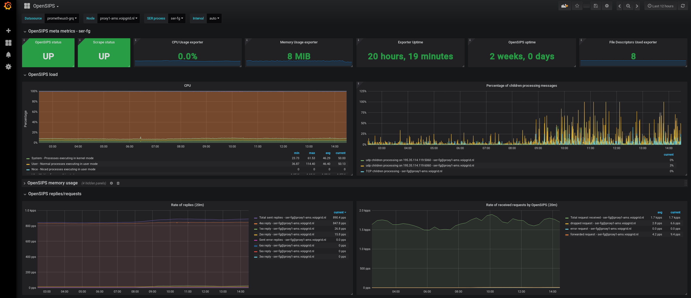

# opensips_exporter 
This exporter exposes OpenSIPS metrics for consumption by Prometheus using the Unix socket 
provided by OpenSIPS. It uses the
OpenSIPS [Management Interface](http://www.opensips.org/Documentation/Interface-MI-2-4) to gather
these statistics. It supports two protocols to communicate with the Management Interface `mi_datagram` for OpenSIPS versions up to 2.4.x and for OpenSIPS versions from 3.0 and higher it supports `mi_http` (JSON-RPC)

Tested and developed against OpenSIPS versions 1.10, 2.4, 3.0, 3.1 though this will probably work with all other versions as well. 

## Status

[](https://goreportcard.com/report/github.com/VoIPGRID/opensips_exporter) 
[](https://hub.docker.com/r/voipgrid/opensips_exporter/)

Active / maintained

This project is considered stable for use in production environments.

## Examples and dashboard
A few examples are provided to give you a clue on how this would be setup on a Prometheus instance:
- [Prometheus scrape config](examples/prometheus.yaml)
- [AlertManager rules](examples/alerts.yaml)

And because gathering the metrics is only half of the story there's [a dashboard](examples/dashboard.json) you can import into a Grafana installation which works wonders with this exporter. The dashboard is also available on the [Grafana dashboard site](https://grafana.com/dashboards/6935). 

A picture is worth a thousand words.

*Note: the dashboard uses elements from the [node exporter](https://github.com/prometheus/node_exporter/) but can still be used without it.*

## Usage

Make sure `$GOPATH/bin` is in your `$PATH`.

```text
Usage of opensips_exporter:
  -addr string
    	Address on which the OpenSIPS exporter listens. (e.g. 127.0.0.1:9434) (default ":9434")
  -http_address string
    	Address to query the management query through HTTP (e.g. http://127.0.0.1:8888/mi/) (default "http://127.0.0.1:8888/mi/")
  -path string
    	The path where metrics will be served. (default "/metrics")
  -protocol string (required)
    	Which protocol to use to get data from the Management Interface (mi_datagram & mi_http currently supported) (default "mi_datagram")
  -socket string
    	Path to the socket file for OpenSIPS.) (default "/var/run/ser-fg/ser.sock")
```

### OpenSIPS up to version 2.4
Up to OpenSIPS version 2.4 the exporter works with the `mi_datagram` module. You can load it in your OpenSIPS config like so:
```
loadmodule "mi_datagram.so"
modparam("mi_datagram", "socket_name", "RUNDIR/ser.sock")
```
Then start the exporter with the following params:
```
opensips_exporter -protocol mi_datagram -socket RUNDIR/ser.sock
```

### OpenSIPS version 3.0 and higher
From OpenSIPS version 3.0 and higher the datagram protocol is not supported, instead you can use the `mi_http` module
which uses JSON-RPC to communicate with the Management Interface. For debian you have to install 
the `opensips-http-modules` to include the module in your OpenSIPS installation. You can load it in your OpenSIPS config like so:
```
loadmodule "httpd.so"
loadmodule "mi_http.so"
modparam("httpd", "ip", "127.0.0.1")
```
By default the management interface listens on port 8888 which is the default in the exporter as well. You can start the exporter with the following params:
```
opensips_exporter -protocol mi_http
```

## Exported Metrics

| Metric | Meaning | Labels | Metric type |
| ------ | ------- | ------ | ------ |
| opensips_up | Whether the opensips exporter could read metrics from the Management Interface socket. (i.e. is OpenSIPS up) | | Gauge |
| opensips_core_bad_URIs_rcvd | Number of URIs that OpenSIPS failed to parse. | | Counter |
| opensips_core_bad_msg_hdr | Number of SIP headers that OpenSIPS failed to parse. | | Counter |
| opensips_core_replies | Number of received replies by OpenSIPS. | kind | Counter |
| opensips_core_replies_total | Total number of received replies by OpenSIPS. | | Counter |
| opensips_core_request | Number of requests by OpenSIPS. | kind | Counter |
| opensips_core_requests_total | Total number of received requests by OpenSIPS. |  | Counter |
| opensips_core_unsupported_methods | Number of non-standard methods encountered by OpenSIPS while parsing SIP methods. | | Counter |
| opensips_core_uptime_seconds | Number of seconds elapsed from OpenSIPS starting. | | Counter |
| opensips_dialog_dialogs | Number of dialogs. | status | Gauge |
| opensips_dialog_received | The number of dialog events received from other OpenSIPS instances. | event | Counter |
| opensips_dialog_sent | Number of replicated dialog requests send to other OpenSIPS instances. | event | Counter |
| opensips_load_load | Percentage of UDP children that are awake and processing SIP messages on the specific UDP interface. |ip, port, protocol| Gauge |
| opensips_load_process | The realtime load of the process ID. (**OpenSIPS >= 2.4**) |process| Gauge |
| opensips_load_tcp_load | Percentage of TCP children that are awake and processing SIP messages. | | Gauge |
| opensips_load_core | The realtime load of entire OpenSIPS - this counts all the core processes of OpenSIPS; the additional processes requested by modules are not counted in this load. (**OpenSIPS >= 2.4**) | | Gauge |
| opensips_load_core_1m | The last minute average load of core OpenSIPS (covering only core/SIP processes) (**OpenSIPS >= 2.4**) | | Gauge |
| opensips_load_core_10m | The last 10 minute average load of core OpenSIPS (covering only core/SIP processes) (**OpenSIPS >= 2.4**) | | Gauge |
| opensips_load_all | The realtime load of entire OpenSIPS, counting both core and module processes. (**OpenSIPS >= 2.4**) | | Gauge |
| opensips_load_all_1m | The last minute average load of entire OpenSIPS (covering all processes). (**OpenSIPS >= 2.4**) | | Gauge |
| opensips_load_all_10m | The last 10 minute average load of entire OpenSIPS (covering all processes). (**OpenSIPS >= 2.4**) | | Gauge |
| opensips_load_1m | The last minute average load of the process ID. (**OpenSIPS >= 2.4**) | ip, port, protocol, process | Gauge |
| opensips_load_10m | The last 10 minute average load of the process ID. (**OpenSIPS >= 2.4**) | ip, port, protocol, process | Gauge |
| opensips_load_processes_number | Number of running OpenSIPS processes. (**OpenSIPS >= 3.0**) |  | Gauge |
| opensips_net_waiting | Number of bytes waiting to be consumed on an interface that OpenSIPS is listening on. | protocol | Gauge |
| opensips_pkmem_fragments | Currently available number of free fragments in the private memory for OpenSIPS process. | pid | Gauge |
| opensips_pkmem_free_size | Free private memory available for the OpenSIPS process. Computed as total_size - real_used_size. | pid | Gauge |
| opensips_pkmem_max_used_size | The maximum amount of private memory ever used by the OpenSIPS process. | pid | Gauge |
| opensips_pkmem_real_used_size | Amount of private memory requested by the OpenSIPS process, including allocator-specific metadata. | pid | Gauge |
| opensips_pkmem_total_size | Total size of private memory available to the OpenSIPS process. | pid | Gauge |
| opensips_pkmem_used_size | Amount of private memory requested and used by the OpenSIPS process. | pid | Gauge |
| opensips_registrar_default_expire | Value of default_expire parameter. | | Gauge |
| opensips_registrar_max_contacts | Value of max_contacts parameter. | | Gauge |
| opensips_registrar_max_expires | Value of max_expires parameter. | | Gauge |
| opensips_registrar_registrations | Number of registrations. | type | Counter |
| opensips_shmem_fragments | Total number of fragments in the shared memory. | | Gauge |
| opensips_shmem_free_size | Free memory available. Computed as total_size - real_used_size | | Gauge |
| opensips_shmem_max_used_size | Maximum amount of shared memory ever used by OpenSIPS processes. | | Gauge |
| opensips_shmem_real_used_size | Amount of shared memory requested by OpenSIPS processes + malloc overhead | | Gauge |
| opensips_shmem_total_size | Total size of shared memory available to OpenSIPS processes. | | Gauge |
| opensips_shmem_used_size | Amount of shared memory requested and used by OpenSIPS processes. | | Gauge |
| opensips_sl_received_ACKs | The number of received_ACKs. | | Counter |
| opensips_sl_replies | The number of replies. | type | Counter |
| opensips_sl_xxx_replies | The number of replies that don't match any other reply status. | | Counter |
| opensips_sl_failures | The number of failures. | | Counter |
| opensips_sl_sent_err_replies_total | The total number of sent_err_replies. | | Counter |
| opensips_sl_sent_replies_total | The total number of sent_replies. | | Counter |
| opensips_tm_inuse_transactions | Number of transactions existing in memory at current time. | | Counter |
| opensips_tm_local_replies_total | Total number of replies local generated by TM module. | | Counter |
| opensips_tm_received_replies_total | Total number of total replies received by TM module. | | Counter |
| opensips_tm_relayed_replies_total | Total number of replies received and relayed by TM module. | | Counter |
| opensips_tm_transactions_total | Total number of transactions. (TM module)| type | Counter |
| opensips_tmx_transactions_total | Total number of transactions. (TMX module) | type | Counter |
| opensips_tmx_UAS_transactions | Total number of transactions created by received requests. | type | Counter |
| opensips_tmx_UAC_transactions | Total number of transactions created by local generated requests. | | Counter |
| opensips_tmx_inuse_transactions | Number of transactions existing in memory at current time. | | Gauge |
| opensips_tmx_active_transactions | Number of ongoing transactions at current time. | | Gauge |
| opensips_tmx_replies | Total number of replies. | type | Counter |
| opensips_uri_negative_checks | Amount of negative URI checks. | | Counter |
| opensips_uri_positive_checks | Amount of positive URI checks. | | Counter |
| opensips_usrloc_registered_users_total | Total number of AOR existing in the USRLOC memory cache for all domains. | | Counter |
| opensips_usrloc_contacts | Number of contacts existing in the USRLOC memory cache for that domain. | domain | Gauge |
| opensips_usrloc_expires | Total number of expired contacts for that domain. | domain | Gauge |
| opensips_usrloc_users | Number of AOR existing in the USRLOC memory cache for that domain. | domain | Gauge |

## Processors

There are processors available per 'module' of OpenSIPS. The processors take the
statistics from the OpenSIPS socket and turn it into a Prometheus metric. You can 
recognise a processor by the naming convention of the metrics. 
For example the`opensips_core_replies` metric comes from the core module and its 
processor can be found in `./processors/core_processor`.

You can find out more about the available modules in the OpenSIPS documentation.

### Filtering enabled processors

It is possible to select what processors you want metrics from. You can do this by
appending `collect[]` parameters to your request. If for example you only want to
get metrics about the [core](http://www.opensips.org/Documentation/Interface-CoreStatistics-2-4) 
and [usrloc](http://www.opensips.org/html/docs/modules/2.4.x/usrloc.html#exported_statistics) 
module you can do this as follows:

```bash
curl localhost:9434/metrics?collect[]=core:&collect[]=usrloc:
```

**_Note: You have to append `:` to the module name for this to work._**

## Development

To work on opensips_exporter, get a recent [Go] and
run:

    go get -u github.com/VoIPGRID/opensips_exporter

The `github.com/VoIPGRID/opensips_exporter/opensips` package contains the
implementation of the interactions with OpenSIPS needed to get statistics from
the mi_datagram Unix socket of a running OpenSIPS. For tests, there is a mock
in the `./internal/mock` package.

Metrics from different OpenSIPS modules are extracted by processors defined in
the `./processors` package. To extend this exporter with metrics from other modules
create your own processor and implement the `Collector` interface. See the other
processors for inspiration. 

## Contributing

See the [CONTRIBUTING.md](.github/CONTRIBUTING.md) file on how to contribute to this project.

## Contributors

See the [CONTRIBUTORS.md](CONTRIBUTORS.md) file for a list of contributors to the project.

[Go]: https://golang.org/doc/install (Getting Started - The Go Programming Language)
[mod]: https://golang.org/ref/mod (Installation · go mod)

## License

opensips_exporter is made available under the Apache 2.0 license. See the [LICENSE](LICENSE) file for more info.
